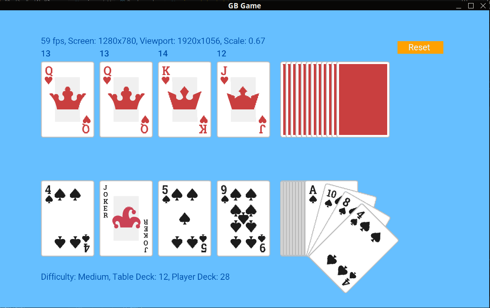

# GBCards

Game inspired from [Ginger Bill game](https://github.com/gingerBill/game-face-the-court).

Instead of Odin I used Golang.



## How to run

Install the dependencies:

- [Go](https://golang.org/dl/)
- [Raylib](https://github.com/gen2brain/raylib-go) (plus requirements based on your OS).

```bash
go run main.go
```